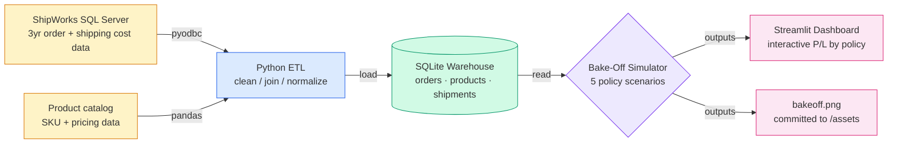

# Shipping Margin Analysis

> End-to-end data pipeline with a dashboard that recovered $42k/yr in shipping margin by identifying the right product markup.

---

## TL;DR

Analyzed 3 years of shipping data from an e-commerce company's ShipWorks SQL database to understand a persistent margin loss. Built a SQL pipeline + Streamlit dashboard that simulates 5 alternative shipping policies on 3 years of historical orders, showing the projected financial outcome of each. The chosen markup-funded bucket model eliminated a ~$42k/yr loss and added ~$17k/yr profit — a ~$60k/yr swing.

---

## The Problem

The site had a long-standing shipping policy: free shipping on orders over $75, and a $6 flat rate on orders under that. The policy looked reasonable on the surface — until one day a shipping invoice came back at **$100 to ship a single $75 order**, meaning the company was losing money outright. Three years of order history confirmed it: the company was bleeding **~$42k/yr** on shipping, and no one had noticed because shipping cost was folded into COGS instead of tracked as its own line item. The question this project answers: **what shipping policy would actually make the company money on freight, without scaring customers away at checkout?**

---

## The Approach

Rather than raise shipping prices blindly and hope they'd cover costs, I wanted evidence-based proof of what would actually fix the bleed. The pipeline simulates **5 alternative shipping policies** against the historical order data: (A) the current policy as a control, (B) raising the markup with a free-shipping threshold, (C) free shipping on every order, (D) full passthrough where the customer pays the carrier rate, and (E) a markup-funded "bucket" model where each sale contributes a small margin pool that absorbs shipping cost.

The results were stark: the current policy (A) was the worst by a wide margin. (C) and (D) either lost money or only broke even. The bucket model (E) was best-of-both-worlds — it generated **+$17k/yr in profit** while keeping shipping free or low-cost on most orders, preserving the customer-friendly feel that the company is known for.

---

## Findings: 5-Policy Bake-Off

| Policy | Description | Projected Annual P/L | vs. Current |
|---|---|---:|---:|
| **A. Current** | Free over $75 / $6 flat under | **−$42k** | — |
| B. Markup + Free $75 | Raise prices, keep $75 threshold | −$2k | +$40k |
| C. Free Shipping | Free on every order | −$4k | +$38k |
| D. Passthrough | Customer pays real carrier rate | $0 | +$42k |
| **E. Bucket Model** ✅ | Margin pool absorbs shipping cost | **+$17k** | **+$59k** |

The simulation results were shocking. The company had been losing ~$42k/yr on shipping under the existing policy. Three of the four alternatives reduced the loss but didn't eliminate it. Only the bucket model (E) flipped shipping from negative to positive — every order contributes a small margin pool that absorbs shipping cost, so customers still see free or low-cost shipping at checkout while the company stops bleeding. I deployed the model to production in June 2026, and the first real production orders confirmed the bucket math to the penny. Shipping has been profitable ever since.

---

## Architecture

The pipeline extracts 3 years of order and shipping-cost data from a production SQL Server warehouse, joins it with product catalog + pricing data, and loads a clean SQLite warehouse keyed on order/product/shipment. The simulator reads from SQLite and applies each of the 5 candidate shipping policies as a SQL transform, projecting annual P/L for every policy. Outputs feed both an interactive Streamlit dashboard (for stakeholder review) and a static PNG (committed to `/assets/` so the README renders without running anything).

For public reproducibility, this repo uses **synthetic data** that mimics the real schema — no proprietary company data leaves the source system.

---

## Tech Stack

**Language**
- Python 3.11+

**Data**
- Microsoft SQL Server (source — order + shipping history) via `pyodbc`
- MongoDB Atlas (source — product catalog + pricing) via `pymongo`
- SQLite (analysis warehouse)

**Analysis**
- pandas, numpy

**Visualization**
- matplotlib (static charts committed to `/assets`)
- Streamlit (interactive dashboard)

**Testing**
- pytest
- gitleaks (pre-commit secret scanning)

**Dev**
- Git
- python-dotenv (env management)
- venv

---

## Status & Roadmap

**Current status:** M0 — repo scaffolding & README.

**Roadmap:**
- [x] **M0** — Repo, README, gitignore, env scaffolding
- [ ] **M1** — ShipWorks SQL extractor + tests
- [ ] **M2** — SQLite warehouse loader
- [ ] **M3** — Bake-off simulator (5 policies)
- [ ] **M4** — Static chart generator → `/assets/bakeoff.png`
- [ ] **M5** — Streamlit dashboard
- [ ] **M6** — Synthetic data generator + public-data setup docs

---

## License

MIT
