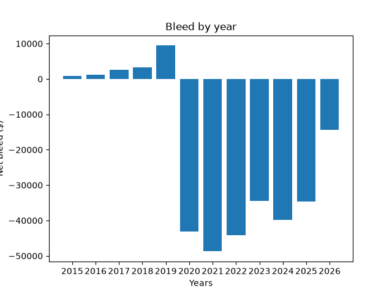

# Shipping Margin Analysis

> A test-driven data pipeline analyzing 16,000 real orders across 11 years of a
> company's shipping history — findings validated against an independent audit to 0.1%.

## TL;DR

I built a Python pipeline (pandas, test-driven with pytest — 23 tests) on 16,000 orders
spanning 11 years of shipping data. It found the company lost **−$108,847 over 2023–2025 —
about $36k/yr — on shipping.** I validated the number two ways: two independently built
methods (a date-filtered sum and a per-year groupby) agree to the dollar, and an independent
audit of the same data came within 0.1%. The fix: product prices were raised ~25% so every
sale funds a per-order shipping budget (the "bucket"). Most orders ship free within their
bucket; when the real carrier cost exceeds it, the customer pays the difference — capping
shipping exposure per order. Deployed June 2026; monitoring shows shipping running within budget.

## The Problem

The store offered free shipping on orders over $75 and a $6 flat rate under that. It looked
reasonable — until a carrier invoice came back at $100 to ship a single $75 order. Shipping
cost was folded into COGS instead of tracked as its own line, so nobody could see the bleed:
about $36k/yr in recent years.

## The Chart

Since 2020 — the free-shipping era — the company lost $34–49k every year. One caveat I
discovered: the pre-2020 "profit" partly rests on rows with unrecorded costs, so the early
positives are less certain than the losses.

## How the Numbers Were Validated

Trust has layers, and each check only covers its own:

1. **Is the math right?** Two independently built methods agree to the dollar, and an
   independent audit of the same source data came within 0.1%.
2. **Are the inputs clean?** A validation layer checks every run — and caught a real
   problem (next section).
3. **Are the inputs complete?** Honest limitation: everything derives from one source
   system. Completeness is an assumption, stated openly.

## Data Quality: the 343 Rows

The validator reported `missing_cost: 0` but `zero_cost: 343` — missing data disguised as
zeros: costs that were never recorded, stored as $0. Of the 343: **205 charged customers
real money with no recorded cost, creating +$26K of fake "profit"**; 138 charged nothing
and net to $0. Decision: **flag and disclose** these rows alongside every result rather
than silently exclude them — the reader judges.

## What's in the Repo

- `src/read_data.py` — read the CSV, standardize column names, filter by year range
- `src/validate.py` — data-quality report (zero / negative / missing cost counts)
- `src/simulations.py` — net bleed, by-lane and by-year aggregations
- `src/charts.py` — matplotlib charts saved to `assets/`
- `src/pipeline.py` — `run_analysis()`: the one-call chain
- `src/extract_shipworks.py` — SQL Server extractor (tests mock the connection)
- `src/load_warehouse.py` — SQLite warehouse loader

## Data Policy

- **Never committed:** raw order data (`*.csv`), internal file paths, and the local runner
  script — all gitignored.
- **Public:** code, tests, and aggregate yearly totals — the same numbers a stakeholder
  report would show.

## Tech Stack

Python 3.12 · pandas · matplotlib · pytest (23 tests, TDD) · pymssql (SQL Server extractor) · SQLite · Git

## Status & Roadmap

- [x] ShipWorks SQL extractor (mocked-connection tests)
- [x] SQLite warehouse loader
- [x] Read / standardize / year-filter on real data
- [x] Bleed analysis — validated vs. independent audit (0.1%)
- [x] Validation layer + the 343-row disclosure
- [x] First real chart
- [ ] Chart polish (currency axis, labels)
- [ ] Streamlit dashboard
- [ ] Synthetic demo dataset
- [ ] Policy comparison — only if it can be done honestly at price parity

## License

MIT